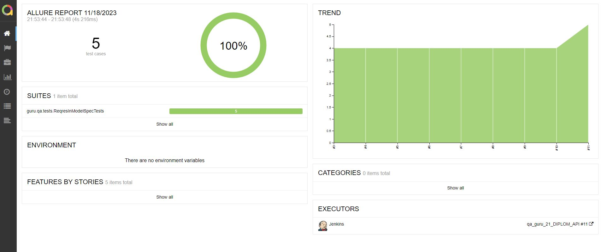
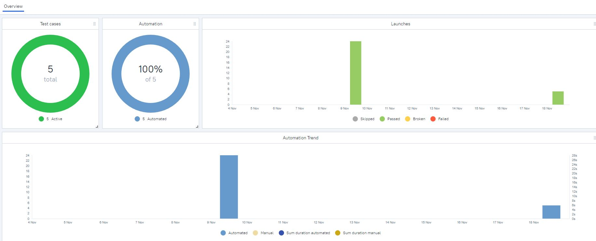
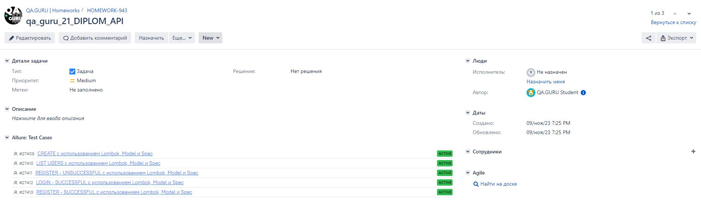

# Автоматизация тестирования API сайта Reqres.in

<kbd>[](https://reqres.in/)</kbd>

## Содержание:
+ [Стек технологий](#computer-Стек-технологий)
+ [Тестовые сценарии](#clipboard-Тестовые-сценарии)
+ [Сборка в Jenkins](#-Сборка-в-Jenkins)
+ [Команды запуска тестов в терминале](#desktop_computer-Команды-запуска-тестов-в-терминале)
+ [Интеграция с Allure report](#-Интеграция-с-Allure-report)
+ [Интеграция с Allure TestOps](#-Интеграция-с-Allure-testOps)
+ [Интеграция с Jira](#-Интеграция-с-Jira)
+ [Информирование в Telegram](#-Информирование-в-Telegram)

## :computer: Стек технологий
<p align="center">
<a href="https://www.java.com/"></a>
<a href="https://github.com/"></a>
<a href="https://www.jetbrains.com/idea/"></a>
<a href="https://gradle.org/"></a>
<a href="https://selenide.org/"></a>
<a href="https://junit.org/junit5/"></a>
<a href="https://aerokube.com/selenoid/"></a>
<a href="https://www.jenkins.io/"></a>
<a href="https://github.com/allure-framework/allure2"></a>
<a href="https://qameta.io/"></a>
<a href="https://www.atlassian.com/software/jira"></a>
<a href="https://rest-assured.io/"></a>
<a href="https://telegram.org/"></a>
</p>

## :clipboard: Тестовые сценарии
+ :white_check_mark: Авторизация пользователя
+ :white_check_mark: Создание пользователя
+ :white_check_mark: Успешная регистрация пользователя
+ :white_check_mark: Неудачная регистрация пользователя
+ :white_check_mark: Проверка списка пользователей

##  Сборка в Jenkins
<kbd>[](https://jenkins.autotests.cloud/job/qa_guru_21_DIPLOM_API/)</kbd>

## :desktop_computer: Команды запуска тестов в терминале
#### Команды для локального запуска:
```bash
./gradlew clean api_test
```

#### Команды для удаленного запуска:
```bash
clean api_test
```

##  Интеграция с Allure report
#### Диаграммы прохождения тестов:
<kbd>[](https://jenkins.autotests.cloud/job/qa_guru_21_DIPLOM_API/allure/#)</kbd>

#### Развернутый результат прохождения тестов:
| Левая часть скриншота | Правая часть скриншота            |
|:----------------------|:----------------------------------|
| Тестовые сценарии     | Подробное описание шагов          |
|                       | Финальный скриншот каждого теста  |
|                       | Исходники страницы теста          |
|                       | Исходники консоли браузера        |
|                       | Финальный ролик с процессом теста |

<kbd>[](https://jenkins.autotests.cloud/job/qa_guru_21_DIPLOM_API/allure/#suites/e5c81c0456aaf0ee8622d771bac038b8/b18314c12160e35b/)</kbd>

##  Интеграция с Allure TestOps
#### Диаграммы прохождения тестов:
<kbd></kbd>

#### Развернутый результат прохождения тестов:
| Левая часть скриншота | Правая часть скриншота            |
|:----------------------|:----------------------------------|
| Тестовые сценарии     | Подробное описание шагов          |
|                       | Финальный скриншот каждого теста  |
|                       | Исходники страницы теста          |
|                       | Исходники консоли браузера        |
|                       | Финальный ролик с процессом теста |

<kbd></kbd>

##  Интеграция с Jira
<kbd></kbd>

##  Информирование в Telegram
#### Оповещение ведется при помощи Telegram bot API:
<kbd></kbd>